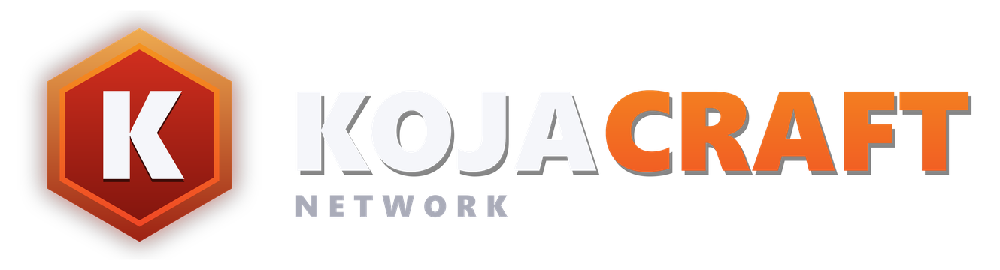

# 🎮 Kojacraft Network

**Next-generation Minecraft server network built for performance, scalability, and innovation**

---

## 🌟 About

Kojacraft is a next-generation Minecraft server network built for performance, scalability, and innovation. Our custom-built infrastructure leverages modern technologies to deliver exceptional performance, advanced anti-cheat systems, and seamless player experiences.

---

## 🛠️ Technology Stack

- **Rust** - High-performance proxy and backend services
- **Next.js & React** - Modern web dashboard
- **Java 21** - Minecraft plugins and mods
- **Docker** - Containerization and deployment

---

## 🚀 Key Features

- **Advanced Anti-Cheat** - Native-level cheat detection with machine learning
- **High Performance** - Custom Rust proxy for minimal latency
- **Multi-Game Support** - Seamless server switching and cross-server communication
- **Analytics Dashboard** - Real-time metrics and monitoring

---

## 👥 Team

**Lead Developer**
- Alex Guy Yann Le Roy (@aleroycz)

**Contributors**
We welcome contributions from the community! See our [Contributing Guidelines](kojacoord-proxy/CONTRIBUTING.md) for more information.

---

## 🤝 Contributing

We love contributions! Whether you're fixing bugs, adding features, or improving documentation, we want your help.

1. Fork the repository
2. Create your feature branch (`git checkout -b feature/AmazingFeature`)
3. Commit your changes (`git commit -m 'Add some AmazingFeature'`)
4. Push to the branch (`git push origin feature/AmazingFeature`)
5. Open a Pull Request

Please read our [Code of Conduct](kojacoord-proxy/CODE_OF_CONDUCT.md) before contributing.

---

## 📄 License

This project is licensed under the MIT License - see the [LICENSE](kojacoord-proxy/LICENSE) file for details.

---

## 🔗 Links

- **Website**: [https://www.kojacraft.net](https://www.kojacraft.net)
- **Documentation**: [Coming Soon]
- **Discord**: [Join our community](https://discord.gg/Xp6wFH3nM6)
- **GitHub**: [https://github.com/kojacraft](https://github.com/kojacraft)

---

**Built with ❤️ for the Minecraft community**

